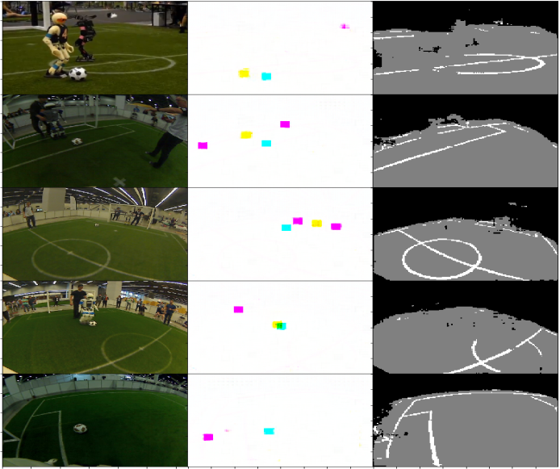

# CUDA-Soccer-Robot-Perception
 
Implemented a unified deep-learning network
for object detection and semantic segmentation for soccer-related objects
and humanoid robots under different lighting conditions as described in the following Paper [https://arxiv.org/abs/1912.07405](https://arxiv.org/abs/1912.07405)

## Sample results from model of detection and field segmentation
The Left column shows the test images. The centre column shows the outcome of object detection. Robots are represented by yellow, goalposts by magenta and ball by cyan color. The Right column shows the output of segmentation head with lines in white, field in gray nad the background in black color.

 
 
